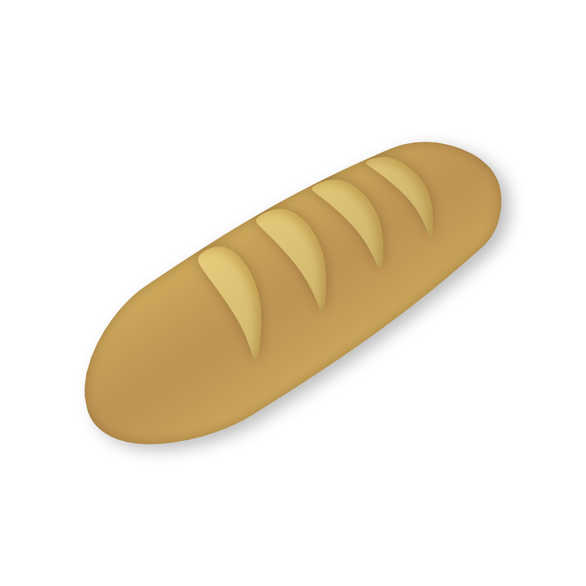

# Welcome to Breadboard 🥖

Breadboard is an artwork discovery and searching app for Android.

Powered by multiple image boards and boorus, Breadboard makes finding your favourite artwork as fast and effortless as possible.

## Features

- **Multiple sites supported:**
  - Safebooru (default & SFW)
  - Danbooru
  - Gelbooru
  - Yande.re
  - Rule34

- **Discover new art:** A dedicated **Browse page** recommends artwork similar to your favourites.

- **Powerful search:** Easily find what you're looking for by including and excluding tags (just use a `-` to exclude) with tag autocompletion. You can also filter by SFW rating level.

- **Download, favourite, and share:** Download images to your device or save them to your favourites to view later, filter your favourites by source and SFW rating, and share images with friends in one tap.

- **Block tags and AI:** You can easily add tags to your blocklist. There's also a convenient option to **hide AI-generated images**.

- **Deep link support:** Open image board links directly in Breadboard, making it easy to share, download, or save the post to your favourites.

- **Modern and familiar:** Breadboard follows Material 3 Expressive's design principles for a simple and friendly experience.

- **Latest Android features:** Breadboard supports dynamic color, a themed icon, and smooth predictive back animations.

## Contributing

Feedback and code contributions are welcome!
