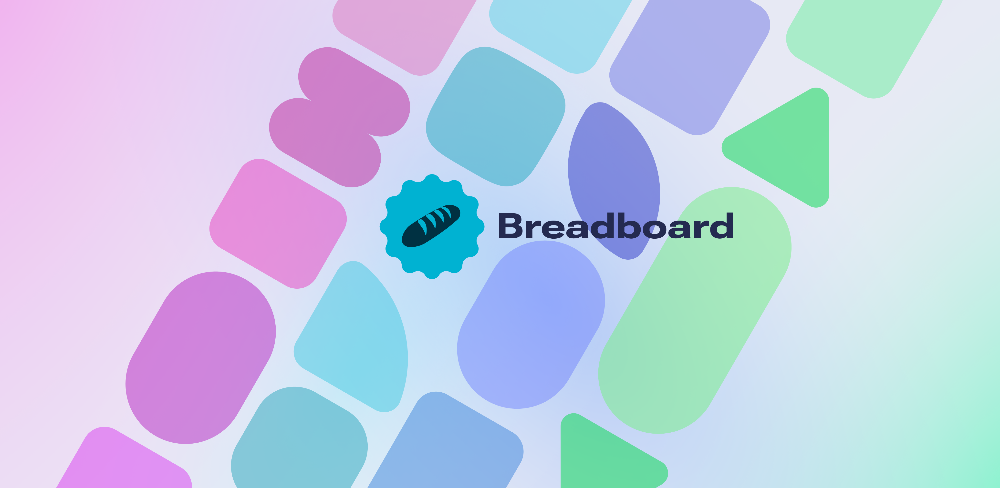
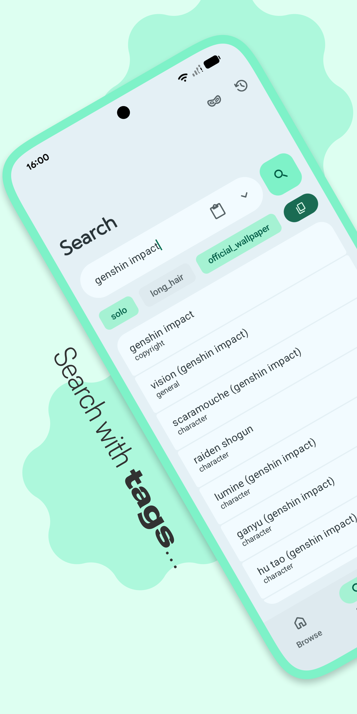
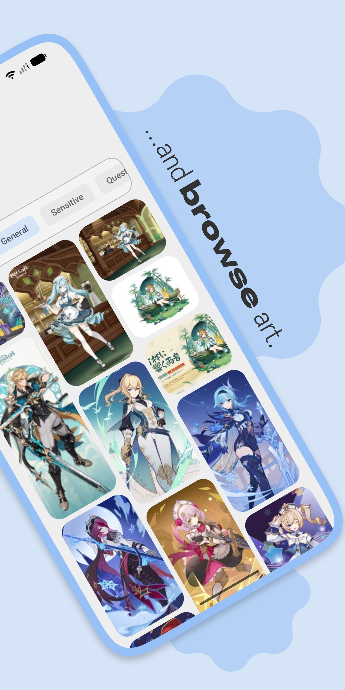
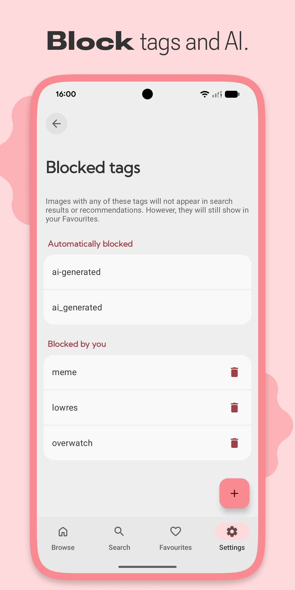
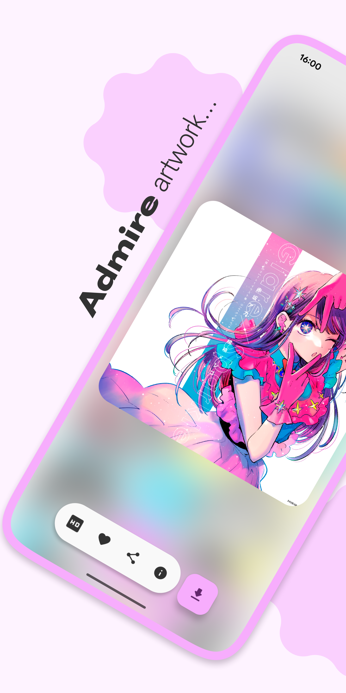
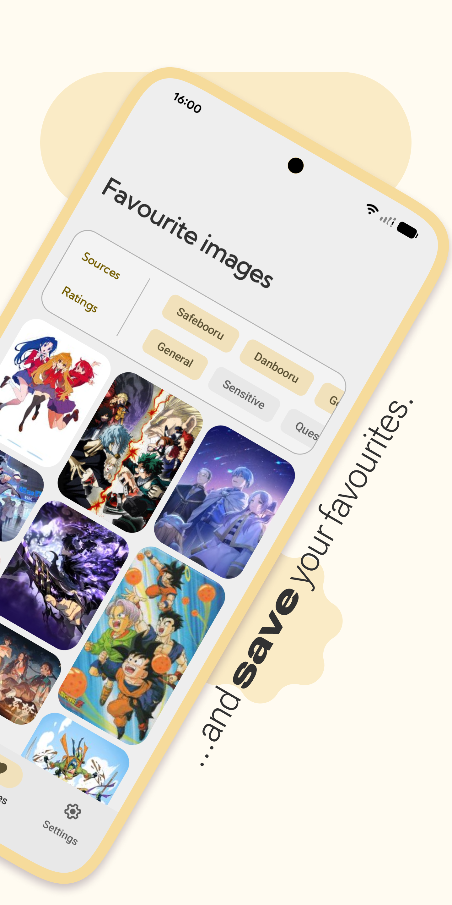
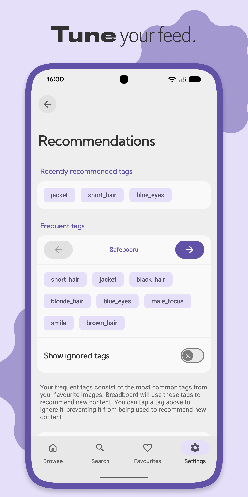
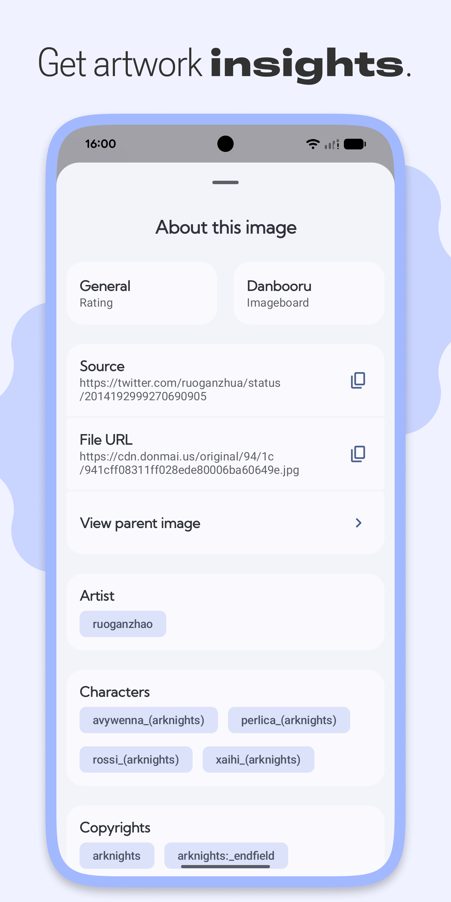
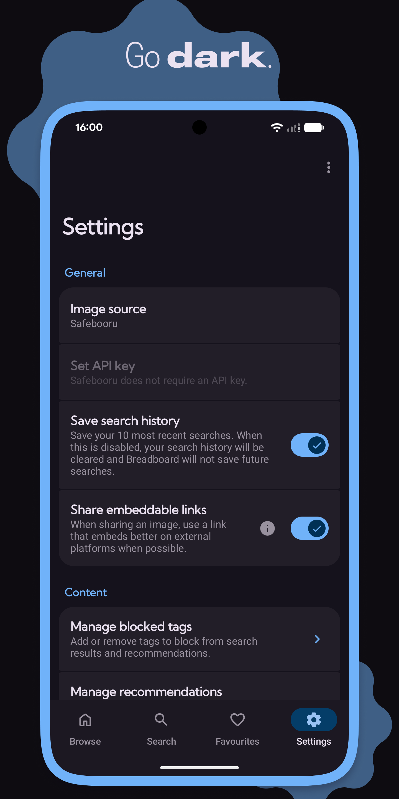

# Welcome to Breadboard 🥖

Breadboard is an artwork discovery and searching app for Android.

Powered by multiple image boards and boorus, Breadboard makes finding your favourite artwork as fast and effortless as possible.

> [!TIP]
> Breadboard is now available on Google Play!
> 
> [Download Breadboard on the Google Play Store](https://play.google.com/store/apps/details?id=moe.apex.breadboard) to benefit from easier installation and automatic updates.

## Features

- **Multiple sites supported:**
  - Safebooru (default & SFW)
  - Danbooru
  - Gelbooru
  - Yande.re
  - Rule34

- **Discover new art:** A dedicated **Browse page** recommends artwork similar to your favourites.

- **Powerful search:** Easily find what you're looking for by including and excluding tags (just use a `-` to exclude) with tag autocompletion. You can also filter by SFW rating level.

- **Download, favourite, and share:** Download images to your device or save them to your favourites to view later, filter your favourites by source and SFW rating, and share images with friends in one tap.

- **Block tags and AI:** You can easily add tags to your blocklist. There's also a convenient option to **hide AI-generated images**.

- **Deep link support:** Open image board links directly in Breadboard, making it easy to share, download, or save the post to your favourites.

- **Modern and familiar:** Breadboard follows Material 3 Expressive's design principles for a simple and friendly experience.

- **Latest Android features:** Breadboard supports dynamic color, a themed icon, and smooth predictive back animations.

## Screenshots

  
  
  
  
  
  
  
  

## Download

### Google Play (recommended)

[Download Breadboard on the Google Play Store](https://play.google.com/store/apps/details?id=moe.apex.breadboard)

### Install manually

Alternatively, download [the latest GitHub release](https://github.com/breadboardapp/breadboard/releases/latest), allow unknown sources in your device settings, and then install manually. This method will not provide automatic/notifications for updates.

> [!WARNING]
> Legacy builds (with the `-legacy` suffix) are deprecated we will cease publishing them in the near future.
>
> Make sure you download a standard release (with no suffix).

## Contributing

Feedback and code contributions are welcome!

Please target the `dev` branch for any pull requests.
